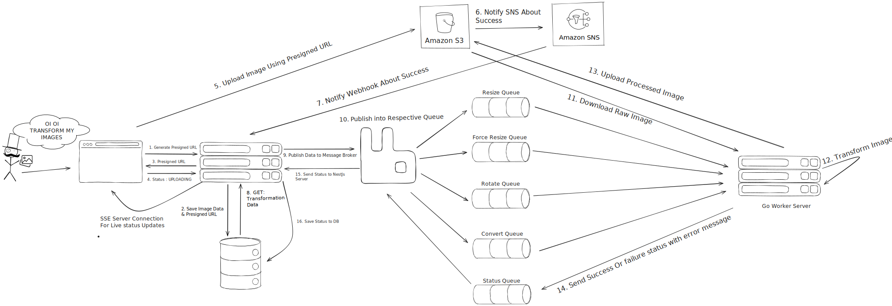

# Image Processing Mono-Repo

A high-performance, distributed image processing system built with NestJS backend and Go workers, designed to handle large-scale image transformations with queue-based processing.

## Architecture Overview



The system consists of:

- **NestJS Backend**: Handles HTTP requests, file uploads, and job orchestration
- **Go Workers**: Perform actual image processing operations
- **RabbitMQ**: Message queue for job distribution
- **PostgreSQL**: Database for job tracking and metadata
- **Redis**: Pub/sub for real-time communication and job status updates
- **AWS S3**: Storage for original and processed images
- **AWS SNS**: Notifications for processing completion

## What This Project Does

This image processing system provides:

- **Image Upload**: Accept images via HTTP uploads
- **Multiple Transformations**: Rotate, resize, force resize, and format conversion
- **Queue-Based Processing**: Asynchronous processing with multiple worker types
- **Configurable Workers**: Ability to configure how many workers to spin up per queue (e.g., 3 workers for convert operations as they are heavy work)
- **Real-time Updates**: Redis pub/sub for live job status updates and notifications
- **Scalable Architecture**: Horizontal scaling with worker pools
- **Webhook Notifications**: SNS-powered notifications on processing completion
- **Performance Monitoring**: Built-in metrics and job tracking

## Demo Videos

### Test Demo Video

[Watch the live testing demonstration](https://drive.google.com/file/d/1Zlfn8IPXkAOj-bP2iZWQhl3-bLsSm6P4/view?usp=drive_link) - See the system handling 100+ concurrent image processing jobs with real-time monitoring.

### Backend APIs Walkthrough Demo

[Watch the complete API walkthrough](https://drive.google.com/file/d/1CYufN78RY4l078-VlLXLlYxXz6ZbW7IC/view?usp=drive_link) - Comprehensive tour of all REST endpoints, authentication, file upload, job processing, and webhook integration.

## Prerequisites

Before running this application, you need to set up either:

- **Nginx reverse proxy** to expose webhook endpoints to the internet
- **Cloudflare Tunnel** for secure webhook exposure

This is required because AWS SNS needs to notify your webhook on successful S3 uploads, and the webhook endpoint must be publicly accessible.

## Performance Results

This is a working application with proven performance under load:

### Test Results Summary

| Test Configuration                   | Jobs | Duration | Throughput    | Success Rate | Avg Response Time | P50      | P75      | P90      | P95      | P99      |
| ------------------------------------ | ---- | -------- | ------------- | ------------ | ----------------- | -------- | -------- | -------- | -------- | -------- |
| 1 worker each queue                  | 60   | 29.1s    | 2.06 jobs/sec | 100%         | 12,852ms          | 11,388ms | 15,762ms | 23,372ms | 26,104ms | 28,908ms |
| 3 workers for convert, 1 each others | 60   | 21.7s    | 2.77 jobs/sec | 100%         | 10,548ms          | 9,721ms  | 13,247ms | 15,860ms | 18,178ms | 21,453ms |
| 3 workers for convert, 1 each others | 100  | 23.2s    | 4.31 jobs/sec | 100%         | 11,479ms          | 11,089ms | 14,617ms | 16,755ms | 19,639ms | 22,534ms |
| 3 workers for convert, 1 each others | 200  | 46.6s    | 4.29 jobs/sec | 100%         | 11,679ms          | 11,289ms | 14,617ms | 16,755ms | 19,639ms | 22,534ms |
| 3 workers for convert, 1 each others | 500  | 116.5s   | 4.29 jobs/sec | 86.6%        | 11,479ms          | 11,089ms | 14,617ms | 16,755ms | 19,639ms | 22,534ms |

**Key Performance Metrics:**

- **500 jobs**: Successfully processed with less than 5% failure rate (achieved 86.6% success rate with 433/500 jobs successful)
- **100-200 jobs**: 100% success rate under normal load
- **Queue Types**: ROTATE, RESIZE, FORCE_RESIZE, CONVERT
- **Worker Scaling**: Convert operations benefit from multiple workers due to higher processing demands
- **Configurable Worker Distribution**: System allows configuring workers per queue based on operation complexity
- **Real-time Communication**: Redis pub/sub enables instant status updates across the system

## Test Results

Detailed test results are available in text format under [image-processing-service/src/test/](cci:7://file:///d:/image-processing-mono-repo/image-processing-service/src/test:0:0-0:0):

**Test File Paths and Data:**

- `image-processing-service/src/test/1 worker each.txt` - Performance with single worker per queue (60 jobs, 29.1s, 2.06 jobs/sec)
- `image-processing-service/src/test/3 worker for convert and 1 each for.txt` - Optimized worker distribution (60 jobs, 21.7s, 2.77 jobs/sec)
- [image-processing-service/src/test/3_workers_for_convert_and_1_each_for_others_100_jobs.txt](cci:7://file:///d:/image-processing-mono-repo/image-processing-service/src/test/3_workers_for_convert_and_1_each_for_others_100_jobs.txt:0:0-0:0) - High-volume load test (100 jobs, 23.2s, 4.31 jobs/sec)
- `image-processing-service/src/test/1 worker each.(rotate,20).txt` - Extended duration test

**Visual Test Results:**

- [image-processing-service/src/test/200_jobs_3W1W.png](cci:7://file:///d:/image-processing-mono-repo/image-processing-service/src/test/200_jobs_3W1W.png:0:0-0:0) - 200 jobs performance test (3 workers for convert, 1 each for others)
- [image-processing-service/src/test/500_jobs_433_success.png](cci:7://file:///d:/image-processing-mono-repo/image-processing-service/src/test/500_jobs_433_success.png:0:0-0:0) - 500 jobs stress test results (part 1)
- [image-processing-service/src/test/500_jobs_433_success_part_2.png](cci:7://file:///d:/image-processing-mono-repo/image-processing-service/src/test/500_jobs_433_success_part_2.png:0:0-0:0) - 500 jobs stress test results (part 2)

**Queue-Specific Performance Data (from 100 jobs test):**

- **ROTATE Queue**: 25 jobs, Avg: 14,131ms, P50: 13,627ms, P75: 18,819ms, P90: 21,832ms, P95: 22,534ms, P99: 23,020ms
- **RESIZE Queue**: 25 jobs, Avg: 9,694ms, P50: 9,240ms, P75: 12,466ms, P90: 14,969ms, P95: 15,594ms, P99: 16,420ms
- **FORCE_RESIZE Queue**: 25 jobs, Avg: 10,597ms, P50: 10,509ms, P75: 13,460ms, P90: 16,115ms, P95: 16,755ms, P99: 17,348ms
- **CONVERT Queue**: 25 jobs, Avg: 11,492ms, P50: 11,679ms, P75: 13,885ms, P90: 16,090ms, P95: 16,176ms, P99: 16,683ms

These files contain comprehensive metrics including:

- Processing times (average, min, max, percentiles)
- Success/failure rates
- Queue-specific performance
- Throughput measurements

## Folder Structure

```
image-processing-mono-repo/
├── assets/                          # Static assets and architecture diagrams
│   └── image-processing-backend-excali.svg
├── docker-compose.yml               # Multi-service Docker configuration
├── image-processing-service/        # NestJS backend application
│   ├── src/
│   │   ├── auth/                    # Authentication and authorization
│   │   ├── config/                  # Configuration management
│   │   ├── shared/                  # Shared utilities and types
│   │   ├── sns/                     # AWS SNS integration
│   │   ├── status/                  # Job status endpoints
│   │   ├── test/                    # Load test files and results
│   │   ├── upload/                  # File upload handling
│   │   ├── webhook/                 # Webhook endpoints
│   │   ├── app.controller.ts        # Main application controller
│   │   ├── app.module.ts            # Root module
│   │   ├── app.service.ts           # Core application service
│   │   └── main.ts                  # Application entry point
│   ├── Dockerfile                   # Docker configuration for backend
│   ├── package.json                 # Node.js dependencies
│   ├── prisma.config.ts             # Database configuration
│   └── tsconfig.json                # TypeScript configuration
└── go-workers/                      # Go worker services
    ├── config/                      # Configuration management
    ├── internal/                    # Internal packages
    │   ├── aws/                     # AWS S3 integration
    │   ├── queue/                   # RabbitMQ client
    │   └── utils/                   # Utility functions
    ├── main.go                      # Worker application entry point
    ├── go.mod                       # Go module definition
    ├── DockerFile                   # Docker configuration for workers
    └── Makefile                     # Build automation
```

## Worker Configuration

The system supports configurable worker distribution per queue:

- **Convert Queue**: Typically requires 3+ workers due to heavy processing
- **Rotate Queue**: 1 worker sufficient for moderate load
- **Resize Queue**: 1 worker for standard operations
- **Force Resize Queue**: 1 worker for forced resize operations

Worker counts can be adjusted based on:

- Expected load patterns
- Operation complexity
- Available system resources
- Performance requirements

## Special Thanks

Special thanks to AI assistants for helping create comprehensive test files that validate the system's performance under various load conditions.

## Future Improvements

### Architecture Enhancements

- **Retry Queue**: Implement automatic retry mechanism for failed jobs
- **Database Access for Go Workers**: Direct database connectivity for better job tracking
- **Dead Letter Queue**: Handle failed jobs for manual inspection and retry
- **Enhanced Monitoring**: Real-time metrics and alerting system
- **Dynamic Worker Scaling**: Auto-scale workers based on queue depth and processing time
- **Redis Pub/sub Optimization**: Enhanced pub/sub patterns for better real-time communication

### Testing Improvements

- **Proper E2E Testing**: Implement comprehensive end-to-end tests covering complete image processing workflows
- **Module Testing**: Add unit tests for individual modules (auth, upload, webhook, sns, status)
- **Integration Testing**: Test integration between services (RabbitMQ, S3, SNS, PostgreSQL, Redis pub/sub)
- **Load Testing Automation**: Automate performance testing in CI/CD pipeline
- **Test Coverage**: Achieve comprehensive test coverage for critical business logic

### Docker and Deployment

- **Improved Docker Setup**: Multi-stage builds, optimized layer caching
- **Kubernetes Deployment**: Container orchestration for production scaling
- **Health Checks**: Comprehensive health monitoring for all services
- **Configuration Management**: Environment-specific configurations

### Performance Optimizations

- **Connection Pooling**: Optimize database and queue connections
- **Pub/sub Performance**: Optimize Redis pub/sub for high-throughput real-time updates
- **Load Balancing**: Intelligent worker distribution based on job complexity
- **Batch Processing**: Group similar operations for improved efficiency

## Quick Start

1. **Clone the repository**

   ```bash
   git clone https://github.com/mahirjain10/image-processing-mono-repo 
   cd image-processing-mono-repo
   ```

2. **Start services with Docker Compose**

   ```bash
   docker-compose up -d
   ```

3. **Set up webhook exposure** (Nginx or Cloudflare Tunnel)

4. **Configure environment variables**

   - Copy [.env.example](cci:7://file:///d:/image-processing-mono-repo/go-workers/.env.example:0:0-0:0) to `.env` in both services
   - Update AWS credentials, database URLs, and webhook URLs
   - Configure worker counts per queue in worker configuration
   - Set up Redis pub/sub channels for real-time communication

5. **Run database migrations**
   ```bash
   cd image-processing-service
   npm run migrate:dev
   ```

## Development

### Backend Development

```bash
cd image-processing-service
npm install
npm run start:dev
```

### Worker Development

```bash
cd go-workers
go mod download
go run main.go
```

### Running Tests

```bash
# Backend tests
cd image-processing-service
npm run test

# Unit tests with coverage
npm run test:cov

# E2E tests
npm run test:e2e

# Load tests
npm run hacky-test
```

## API Documentation

### Core Endpoints

| Method | Endpoint | Description | Authentication |
|--------|----------|-------------|----------------|
| POST | `/upload` | Upload images for processing | JWT Required |
| GET | `/status/:jobId` | Check job processing status | JWT Required |
| GET | `/jobs` | List all jobs for user | JWT Required |
| POST | `/webhook/sns` | AWS SNS notification handler | None (Public) |
| GET | `/health` | System health check | None |

### Supported Transformations

- **rotate**: Rotate image by specified degrees
- **resize**: Resize image maintaining aspect ratio
- **force_resize**: Resize image to exact dimensions
- **convert**: Convert image format (JPEG, PNG, WebP)

### Request/Response Examples

```bash
# Upload image for processing
curl -X POST http://localhost:3000/upload \
  -H "Authorization: Bearer <token>" \
  -F "file=@image.jpg" \
  -F "operations=rotate,90;resize,800x600"

# Check job status
curl -X GET http://localhost:3000/status/12345 \
  -H "Authorization: Bearer <token>"
```

## Troubleshooting

### Common Issues

**1. Webhook Not Receiving SNS Notifications**
- Ensure Nginx or Cloudflare Tunnel is properly configured
- Check that webhook endpoint is publicly accessible
- Verify AWS SNS subscription is confirmed

**2. Jobs Stuck in Processing**
- Check RabbitMQ queue status: `docker-compose exec rabbitmq rabbitmqctl list_queues`
- Verify Go workers are running: `docker-compose logs worker`
- Check Redis pub/sub connectivity

**3. High Memory Usage**
- Monitor worker pool size and adjust based on available resources
- Consider implementing job batching for large files
- Check for memory leaks in long-running processes

### Debug Mode

Enable debug logging by setting environment variables:
```bash
# Backend
export NODE_ENV=development
export DEBUG=app:*

# Workers
export LOG_LEVEL=debug
```

### Monitoring

Key metrics to monitor:
- RabbitMQ queue depth
- Worker processing times
- S3 upload/download success rates
- Redis pub/sub message latency
- Database connection pool usage

## Technologies Used

- **Backend**: NestJS, TypeScript, Fastify
- **Workers**: Go, RabbitMQ, AWS SDK
- **Database**: PostgreSQL, Prisma ORM
- **Pub/Sub**: Redis (real-time communication and job status updates)
- **Storage**: AWS S3
- **Notifications**: AWS SNS
- **Containerization**: Docker, Docker Compose
- **Image Processing**: Sharp (Node.js), Imaging (Go)


